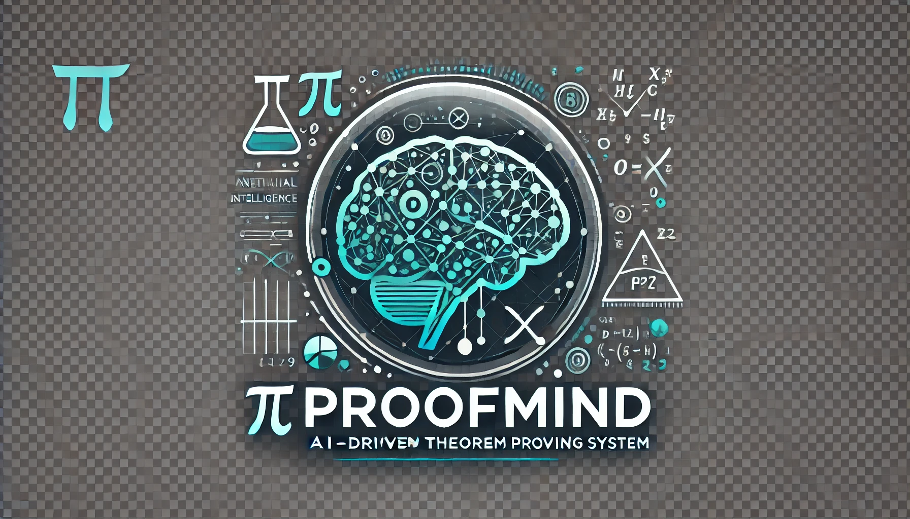

# ProofMind



ProofMind is a deep learning-based automated theorem proof generator that analyzes input theorem features to generate corresponding proof steps. The project also integrates a symbolic reasoning module to support theorem verification and generation across various mathematical domains.

## Features

- **Data Download**: Automatically downloads and validates required theorem datasets.
- **Data Processing**: Cleans, splits, and performs feature engineering on raw data.
- **Model Training**: Trains deep learning models to generate theorem proofs.
- **Symbolic Reasoning**: Integrates Coq and Lean reasoning engines.
- **Visualization**: Includes visualizations such as model training history.

## Prerequisites

Before starting, ensure your system meets the following requirements:

- **Operating System**: Any OS supporting CPU execution.
- **Python**: Version 3.11.
- **Dependencies**:

```shell
pip install -r requirements.txt
```

The requirements.txt file contains all necessary Python libraries for the project.

## Installation

1. **Clone the repository**:

```shell
git clone <https://github.com/chenxingqiang/ProofMind.git>
```

2. **Navigate to the project directory**:

```shell
cd ProofMind
```

3. **Install dependencies**:

```shell
pip install -r requirements.txt
```

## Usage

### Full Pipeline Execution

To execute the complete pipeline, including data download, processing, and model training, run:

```shell
python src/main.py --mode all --data-dir data --output-dir output
```

### Specific Mode Execution

Available command-line arguments:

- **--mode**: Execution mode; options are all, download, process, train.
- **--data-dir**: Directory for storing data.
- **--output-dir**: Directory for storing output results.

For example, to run only data processing and model training:

```shell
python src/main.py --mode process,train --data-dir data --output-dir output
```

## Project Structure

```
ProofMind/
├── LICENSE
├── README.md
├── best_model.pt
├── config/
│  └── config.yaml
├── data/
│  ├── algebra/
│  │  ├── algebra_theorems.json
│  │  └── theorems.json
│  ├── number_theory/
│  │  ├── number_theory_theorems.json
│  │  └── theorems.json
│  └── topology/
│    ├── theorems.json
│    └── topology_theorems.json
├── docs/
│  ├── paper.md
│  └── proofmind_logo.png
├── output/
│  ├── final_model.pt
│  └── training_history.png
├── proofmind.egg-info/
├── requirements.txt
├── setup.py
├── src/
│  ├── __init__.py
│  ├── data/
│  │  ├── __init__.py
│  │  ├── data_downloader.py
│  │  ├── data_loader.py
│  │  ├── data_processor.py
│  │  ├── download_data.py
│  │  ├── feature_engineering.py
│  │  ├── generate_sample_data.py
│  │  └── validate_data.py
│  ├── main.py
│  ├── prepare_data.py
│  ├── proof_generator.py
│  ├── proof_verifier.py
│  ├── symbolic_reasoning/
│  │  ├── coq_integration.py
│  │  ├── lean_integration.py
│  │  └── symbolic_engine.py
│  ├── theorem_generator.py
│  ├── utils.py
│  └── visualization.py
├── tests/
│  ├── test_proof_generator.py
│  ├── test_proof_verifier.py
│  └── test_theorem_generator.py
└── tutorials/
  ├── copy_of_knot_theory.ipynb
  └── copy_of_representation_theory.ipynb
```

## Contribution

Contributions to ProofMind are welcome. You can participate by suggesting improvements, reporting issues, or contributing code. To contribute:

1. **Fork the repository**:

   Click the “Fork” button on the GitHub page to create a copy under your account.

2. **Create a new branch**:

   ```shell
   git checkout -b feature/YourFeatureName
   ```

3. **Commit your changes**:

   ```shell
   git commit -m 'Add some feature'
   ```

4. **Push to the branch**:

   ```shell
   git push origin feature/YourFeatureName
   ```

5. **Create a Pull Request**:

   Submit your changes for review on GitHub.

## License

This project is licensed under the MIT License. See the [LICENSE](LICENSE) file for details.

## Contact

- **Author**: Xingqiang Chen
- **GitHub**: [@chenxingqiang](https://github.com/chenxingqiang)
- **Email**: <chen.xingqiang@iechor.com>

For any questions or suggestions, feel free to contact me.
